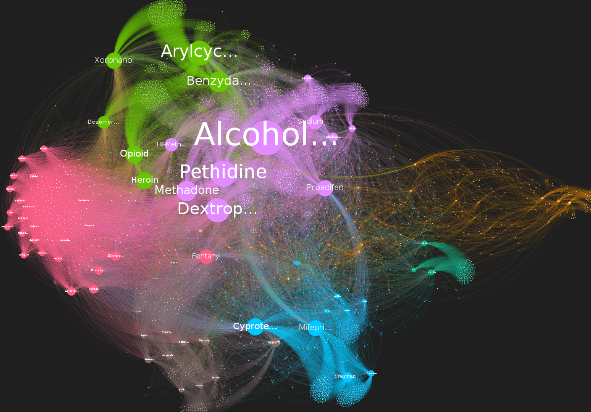

# Idrawiki

Herramienta para rastrear Wikipedia a partir de un articulo base y generar redes de palabras, bigramas e hipervinculos listas para analizar en Gephi, Cytoscape u otros entornos.


La idea del proyecto es sencilla: eliges un articulo inicial de Wikipedia, el pipeline recorre enlaces internos, limpia el texto, construye redes y exporta CSV que luego puedes visualizar.

## Que hace esta herramienta

- permite elegir el nodo inicial de Wikipedia
- permite activar o desactivar la poda
- genera una red textual de palabras y bigramas
- genera una red de enlaces entre articulos
- exporta CSV faciles de abrir en Gephi
- esta separada en clases para que sea mas facil de mantener y ampliar

## Para quien esta pensada

Este proyecto esta pensado para:

- trabajos de clase
- exploracion de temas en Wikipedia
- comparacion entre conceptos o dominios
- visualizacion de relaciones entre terminos y articulos

## Flujo rapido de uso

🐍 Elige un articulo base.  
🐍 Ejecuta el pipeline con pocos articulos al principio.  
🐍 Revisa los CSV generados.  
🐍 Abre los nodos y aristas en Gephi.  
🐍 Ajusta poda y repite hasta obtener una red legible.  

## Estructura

```text
Idrawiki/
|-- pipeline.py
|-- requirements.txt
|-- img/
|   |-- hidra-de-lerna.png
|   |-- texto.png
|   |-- enalces.png
|   `-- buenofeomalo.png
|-- data/
|   |-- links/
|   |-- words/
|   `-- nodos_visitados.txt
`-- src/
    |-- config.py
    |-- wikipedia_crawler.py
    |-- text_processing.py
    |-- graph_builder.py
    |-- exporter.py
    |-- greedy_mod.py
    |-- top_modularity.py
    `-- clean_links_csv.py
```

## Arquitectura

### `PipelineConfig`

Centraliza la configuracion del pipeline: articulo inicial, URL base, limites de scraping, parametros de poda y rutas de salida.

### `WikipediaTextProcessor`

Carga el modelo de spaCy y se encarga de:

- limpiar texto
- extraer lemas y entidades
- generar bigramas

### `WikipediaCrawler`

Hace el scraping con reintentos HTTP, recorre enlaces internos de Wikipedia y devuelve:

- palabras por articulo
- bigramas por articulo
- red de enlaces
- lista de articulos visitados

### `GraphBuilder`

Construye:

- la red de palabras y bigramas
- la red dirigida de hipervinculos

Tambien aplica la poda si esta activada.

### `GraphExporter`

Exporta nodos, aristas y el listado de URLs visitadas.

## Requisitos

- Python 3.10 o superior recomendado
- modelo `en_core_sci_md` instalado

Instalacion base:

```bash
python -m venv .venv
.venv\Scripts\activate
pip install -r requirements.txt
pip install https://s3-us-west-2.amazonaws.com/ai2-s2-scispacy/releases/v0.5.0/en_core_sci_md-0.5.0.tar.gz
```

## Empezar en 3 minutos

### 1. Ejecuta una prueba pequena

```bash
python pipeline.py --seed-article "Artificial intelligence" --max-articles 25 --max-depth 2
```

Con esto validas rapido que:

- el scraping funciona
- el modelo carga bien
- se generan CSV
- la red no sale inmanejable

### 2. Revisa la salida

Al terminar deberias tener:

- `data/words/words_bigrams_nodes.csv`
- `data/words/words_bigrams_edges.csv`
- `data/links/links_nodes.csv`
- `data/links/links_edges.csv`
- `data/nodos_visitados.txt`

### 3. Abre Gephi y carga los CSV

Importa primero nodos y luego aristas. Mas abajo tienes una guia especifica para Gephi.

## Uso del pipeline

Ejemplo minimo:

```bash
python pipeline.py
```

Eso arranca desde `https://en.wikipedia.org/wiki/Fentanyl`.

### Ejemplo recomendado

Ejemplo equilibrado para una primera prueba:

```bash
python pipeline.py --seed-article "Artificial intelligence" --max-articles 40 --max-depth 2 --min-link-freq 2 --edge-prune-percentile 35 --node-prune-percentile 10 --min-edge-weight 2 --min-node-freq 2
```

### Ejemplo en Wikipedia en espanol

```bash
python pipeline.py --base-url "https://es.wikipedia.org" --seed-article "Medicina" --max-articles 30 --max-depth 2
```

### Elegir el nodo base

Por titulo de articulo:

```bash
python pipeline.py --seed-article "Artificial intelligence"
```

Por URL completa:

```bash
python pipeline.py --seed-url "https://es.wikipedia.org/wiki/Inteligencia_artificial"
```

Si usas otra Wikipedia, tambien puedes fijar la base:

```bash
python pipeline.py --base-url "https://es.wikipedia.org" --seed-article "Medicina"
```

### Controlar la poda

Desactivar solo la poda de enlaces:

```bash
python pipeline.py --disable-link-pruning
```

Desactivar la poda de la red textual:

```bash
python pipeline.py --disable-word-pruning
```

Ajustar umbrales:

```bash
python pipeline.py --seed-article "Fentanyl" --max-articles 150 --max-depth 3 --min-link-freq 2 --edge-prune-percentile 35 --node-prune-percentile 10 --min-edge-weight 3 --min-node-freq 3
```

## Consejos rapidos

- ✅ Empieza con `--max-articles` y `--max-depth` bajos para comprobar que el tema genera una red interpretable.
- ✂️ En la mayoria de casos se recomienda mantener la poda activada para limpiar ruido y reducir el tamano del grafo.
- 📉 Si la red sale demasiado grande, baja `--max-articles`, `--max-depth` o endurece la poda.
- 💾 Guarda siempre el comando exacto con el que generaste los CSV.
- 🧪 Si vais a comparar resultados entre companeros, usad el mismo nodo base y los mismos parametros.

## Parametros principales

`pipeline.py` expone estos argumentos:

- `--base-url`: dominio base de Wikipedia
- `--seed-article`: articulo inicial a partir del titulo
- `--seed-url`: URL completa del articulo inicial
- `--max-articles`: limite total de articulos rastreados
- `--max-depth`: profundidad maxima del rastreo
- `--min-link-freq`: frecuencia minima para conservar enlaces en la red de links
- `--top-n-bigrams`: numero de bigramas integrados en la red textual
- `--edge-prune-percentile`: percentil de poda de aristas
- `--node-prune-percentile`: percentil de poda de nodos
- `--min-node-freq`: frecuencia minima de nodo
- `--min-edge-weight`: peso minimo de arista
- `--disable-link-pruning`: desactiva la poda de enlaces
- `--disable-word-pruning`: desactiva la poda de la red textual
- `--output-dir`: carpeta de salida
- `--spacy-model`: modelo NLP a cargar

Consulta rapida:

```bash
python pipeline.py --help
```

## Que tipos de redes salen

### Red textual

La red textual mezcla palabras individuales y bigramas detectados en los articulos rastreados.

Sirve para:

- detectar conceptos centrales
- localizar terminos repetidos
- ver agrupaciones tematicas
- estudiar coocurrencias

Ejemplo del tipo de visualizacion que puede salir:


### Red de enlaces

La red de enlaces conecta articulos de Wikipedia entre si.

Sirve para:

- ver la estructura de navegacion entre paginas
- detectar articulos puente
- estudiar que temas quedan mas conectados
- identificar hubs o nodos muy enlazados

Ejemplo del tipo de visualizacion que puede salir:



## Salidas y formato

El pipeline genera:

- `data/words/words_bigrams_nodes.csv`
- `data/words/words_bigrams_edges.csv`
- `data/links/links_nodes.csv`
- `data/links/links_edges.csv`
- `data/nodos_visitados.txt`

### Formato de la red textual

Nodos:

- `Id`
- `Label`
- `Group`
- `Attribute`

Aristas:

- `Source`
- `Target`
- `Type`
- `Weight`

### Formato de la red de enlaces

Nodos:

- `Id`
- `Label`
- `Group`
- `Attribute`

Aristas:

- `Source`
- `Target`
- `Type`
- `Weight`

## Uso en Gephi

### Orden recomendado de importacion

1. Importa primero el archivo de nodos, por ejemplo `data/words/words_bigrams_nodes.csv`.
2. Importa despues el archivo de aristas correspondiente, por ejemplo `data/words/words_bigrams_edges.csv`.
3. En la importacion de aristas, usa `Source` y `Target` como identificadores.
4. Si estas trabajando con la red textual, tratala como no dirigida.
5. Si estas trabajando con la red de enlaces, mantenla dirigida.

### Ajustes utiles en Gephi

- en `Appearance`, colorea por `Group`
- en `Ranking`, usa `Attribute` o `Degree` para escalar nodos
- en `Layout`, prueba `ForceAtlas 2`
- activa `Prevent Overlap` si los nodos se montan
- si el grafo es enorme, aplica filtros por grado antes de visualizar
- para etiquetas, activa `Labels` solo al final para que no se vuelva lento

### Configuracion minima para que funcione bien

Para una primera visualizacion razonable:

- Layout: `ForceAtlas 2`
- Escalado de tamano: por `Degree`
- Color: por `Group`
- Filtro opcional: `Degree Range`
- Etiquetas: mostrar solo cuando el layout ya este estabilizado

## Advertencias


- ⚠️ Si importas una red muy grande sin poda, Gephi puede quedarse pesado o incluso bloquearse.
- ⚠️ Si el tema es muy amplio, Wikipedia puede arrastrar cientos de enlaces y la red crecer muy rapido.
- ⚠️ Si cambias de idioma en Wikipedia, conviene cambiar tambien el modelo NLP para que el texto se procese mejor.
- ⚠️ Si subes demasiado `--max-depth`, la red puede dejar de representar el tema inicial y volverse demasiado general.

Recomendacion practica:

- ✅ Para casi cualquier primera prueba, usa poda activa y `--max-depth 2`.

## Scripts auxiliares

### Limpiar labels de enlaces

```bash
python src/clean_links_csv.py --input data/links/links_nodes.csv --output data/links/links_nodes_clean.csv --base-url https://es.wikipedia.org
```

### Calcular comunidades con modularidad codiciosa

```bash
python src/greedy_mod.py --nodes data/words/words_bigrams_nodes.csv --edges data/words/words_bigrams_edges.csv
```

### Resumir comunidades desde un CSV con metricas

```bash
python src/top_modularity.py --csv data/words/words_metrics_nodes.csv --top-n 10
```

## Tests

La suite actual cubre:

- configuracion del pipeline
- construccion de grafos y poda
- filtrado de enlaces de Wikipedia
- exportacion de CSV
- limpieza de labels de enlaces

Ejecucion:

```bash
python -m unittest discover -s tests -v
```

## Recomendaciones para uso en clase

- usa `--max-depth` pequeno al principio para validar que el tema produce una red util
- genera primero una red textual y luego una de enlaces para comparar enfoques
- guarda el comando exacto que has lanzado junto con los CSV
- si dos personas van a comparar resultados, fija los mismos parametros de poda
- si quieres explorar una Wikipedia distinta, usa `--seed-url` o cambia `--base-url`

## Limitaciones actuales

- el procesamiento textual esta orientado al ingles por el modelo `en_core_sci_md`
- si cambias a otro idioma de Wikipedia, conviene cambiar tambien el modelo NLP
- el scraping puede tardar bastante si `--max-articles` y `--max-depth` son altos
- los resultados dependen bastante del nodo inicial y de la configuracion elegida

## Licencia

MIT. Ver [LICENSE](LICENSE).
